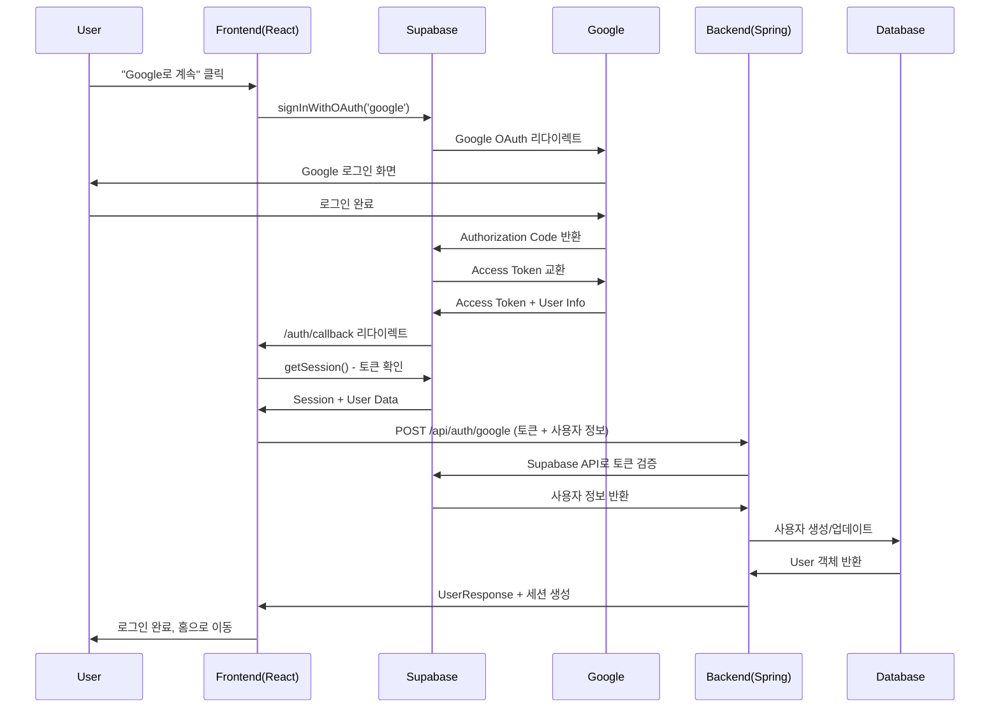

# 🔐 Supabase + Google OAuth 연동 전체 시나리오 설계

## 📋 **전체 아키텍처 개요**



---

## 🔧 **1단계: Supabase 프로젝트 설정**

### **1.1 Supabase 프로젝트 생성**
- Supabase 대시보드에서 새 프로젝트 생성
- 프로젝트 URL과 API 키 확보
- Authentication 설정에서 Google Provider 활성화

### **1.2 Google Cloud Platform 설정**
- GCP Console에서 OAuth 2.0 클라이언트 ID 생성
- 승인된 리다이렉트 URI 설정:
  - `https://[your-project-id].supabase.co/auth/v1/callback`
- 클라이언트 ID와 시크릿을 Supabase에 등록

### **1.3 Supabase Authentication 설정**
```yaml
# Supabase Dashboard > Authentication > Settings
Site URL: http://localhost:5173
Redirect URLs: 
  - http://localhost:5173/auth/callback
  - http://localhost:3000/auth/callback

# Google OAuth Provider 설정
Client ID: [Google Cloud Console에서 생성한 클라이언트 ID]
Client Secret: [Google Cloud Console에서 생성한 시크릿]
```

---

## 🎨 **2단계: Frontend 시나리오 (React)**

### **2.1 필요한 패키지 설치**
```bash
npm install @supabase/supabase-js
```

### **2.2 환경 변수 설정**
```env
# .env.local
VITE_SUPABASE_URL=https://your-project-id.supabase.co
VITE_SUPABASE_ANON_KEY=your-anon-key
```

### **2.3 Frontend 흐름 시나리오**

#### **Step 1: Supabase 클라이언트 초기화**
```typescript
// services/supabase/supabaseClient.ts
import { createClient } from '@supabase/supabase-js'

export const supabase = createClient(
  process.env.VITE_SUPABASE_URL,
  process.env.VITE_SUPABASE_ANON_KEY,
  {
    auth: {
      autoRefreshToken: true,
      persistSession: true,
      detectSessionInUrl: true
    }
  }
)
```

#### **Step 2: Google OAuth 로그인 함수**
```typescript
// services/auth/authService.ts
export const signInWithGoogle = async () => {
  const { data, error } = await supabase.auth.signInWithOAuth({
    provider: 'google',
    options: {
      redirectTo: `${window.location.origin}/auth/callback`,
      queryParams: {
        access_type: 'offline',
        prompt: 'consent'
      }
    }
  })
  
  if (error) throw error
  return data
}
```

#### **Step 3: 인증 상태 관리 Hook**
```typescript
// hooks/useSupabaseAuth.ts
export const useSupabaseAuth = () => {
  const [session, setSession] = useState(null)
  const [loading, setLoading] = useState(true)
  
  useEffect(() => {
    // 초기 세션 확인
    supabase.auth.getSession().then(({ data: { session } }) => {
      setSession(session)
      if (session) {
        // 백엔드로 토큰 전송하여 사용자 생성/로그인
        authenticateWithBackend(session)
      }
      setLoading(false)
    })
    
    // 인증 상태 변경 리스너
    const { data: { subscription } } = supabase.auth.onAuthStateChange(
      async (event, session) => {
        setSession(session)
        if (event === 'SIGNED_IN' && session) {
          await authenticateWithBackend(session)
        }
      }
    )
    
    return () => subscription.unsubscribe()
  }, [])
  
  return { session, loading, signInWithGoogle, signOut }
}
```

#### **Step 4: 백엔드 인증 처리**
```typescript
// services/auth/authService.ts
const authenticateWithBackend = async (session) => {
  const response = await api.post('/auth/google', {
    accessToken: session.access_token,
    providerId: session.user.id,
    nickname: session.user.user_metadata.name,
    avatarUrl: session.user.user_metadata.avatar_url,
    email: session.user.email
  })
  
  return response.data
}
```

#### **Step 5: 로그인 모달 업데이트**
```typescript
// NicknameModal.tsx
export default function NicknameModal({ isOpen, onClose }) {
  const { signInWithGoogle, loading } = useSupabaseAuth()
  
  const handleGoogleLogin = async () => {
    try {
      await signInWithGoogle()
      // OAuth 리다이렉트가 발생하므로 여기서는 대기
    } catch (error) {
      toast.error('Google 로그인에 실패했습니다.')
    }
  }
  
  return (
    // Google 버튼에 handleGoogleLogin 연결
  )
}
```

#### **Step 6: 콜백 페이지**
```typescript
// pages/AuthCallback.tsx
export default function AuthCallback() {
  const navigate = useNavigate()
  const { session, loading } = useSupabaseAuth()
  
  useEffect(() => {
    if (!loading) {
      if (session) {
        // 로그인 성공 - 홈으로 리다이렉트
        navigate('/', { replace: true })
      } else {
        // 로그인 실패 - 홈으로 리다이렉트
        navigate('/', { replace: true })
      }
    }
  }, [session, loading, navigate])
  
  return <div>로그인 처리 중...</div>
}
```

---

## 🔧 **3단계: Backend 시나리오 (Spring Boot)**

### **3.1 환경 변수 설정**
```yaml
# application.yml
supabase:
  url: ${SUPABASE_URL:https://your-project-id.supabase.co}
  service-role-key: ${SUPABASE_SERVICE_ROLE_KEY:your-service-role-key}
```

### **3.2 Backend 흐름 시나리오**

#### **Step 1: DTO 정의**
```java
// dto/GoogleAuthRequest.java
public class GoogleAuthRequest {
    @NotBlank private String accessToken;
    @NotBlank private String providerId;
    @NotBlank private String nickname;
    private String avatarUrl;
    private String email;
}
```

#### **Step 2: Supabase 토큰 검증 서비스**
```java
// service/SupabaseAuthService.java
@Service
public class SupabaseAuthService {
    
    public SupabaseUserInfo validateUser(String accessToken) {
        // Supabase API를 통해 토큰 검증
        // GET https://[project-id].supabase.co/auth/v1/user
        // Authorization: Bearer [accessToken]
        
        // 사용자 정보 반환 또는 null (검증 실패)
    }
}
```

#### **Step 3: 사용자 서비스 확장**
```java
// service/UserService.java
public interface UserService {
    UserResponse createGuestUser(GuestUserCreateRequest request);
    UserResponse createOrUpdateGoogleUser(String providerId, String nickname, String avatarUrl, String email);
}

// service/UserServiceImpl.java
@Override
public UserResponse createOrUpdateGoogleUser(String providerId, String nickname, String avatarUrl, String email) {
    // 1. Google 사용자 조회 (provider=GOOGLE, providerId로)
    Optional<User> existingUser = userRepository.findByProviderAndProviderId(UserProvider.GOOGLE, providerId);
    
    User user;
    if (existingUser.isPresent()) {
        // 기존 사용자 업데이트
        user = existingUser.get();
        user.updateProfileFromOAuth(nickname, avatarUrl);
    } else {
        // 새 사용자 생성
        user = User.createOAuth(UserProvider.GOOGLE, providerId, nickname, avatarUrl);
    }
    
    User saved = userRepository.save(user);
    return createUserResponse(saved);
}
```

#### **Step 4: 컨트롤러 추가**
```java
// controller/AuthController.java
@PostMapping("/auth/google")
public ResponseEntity<UserResponse> authenticateWithGoogle(@Valid @RequestBody GoogleAuthRequest request, HttpServletRequest httpRequest) {
    try {
        // 1. Supabase 토큰 검증
        SupabaseUserInfo supabaseUser = supabaseAuthService.validateUser(request.getAccessToken());
        if (supabaseUser == null) {
            return ResponseEntity.status(HttpStatus.UNAUTHORIZED).build();
        }
        
        // 2. 사용자 생성/업데이트
        UserResponse userResponse = userService.createOrUpdateGoogleUser(
            request.getProviderId(),
            request.getNickname(),
            request.getAvatarUrl(),
            request.getEmail()
        );
        
        // 3. 세션 생성
        HttpSession session = httpRequest.getSession(true);
        session.setAttribute("userId", userResponse.getUserId());
        session.setAttribute("nickname", userResponse.getNickname());
        session.setAttribute("avatarUrl", userResponse.getAvatarUrl());
        session.setAttribute("provider", "GOOGLE");
        
        return ResponseEntity.ok(userResponse);
        
    } catch (Exception e) {
        return ResponseEntity.status(HttpStatus.INTERNAL_SERVER_ERROR).build();
    }
}
```

#### **Step 5: Security 설정 업데이트**
```java
// config/SecurityConfig.java
@Bean
public SecurityFilterChain securityFilterChain(HttpSecurity http) throws Exception {
    http
        .authorizeHttpRequests(authz -> authz
            .requestMatchers("/api/users/guest", "/api/auth/google", "/api/auth/me", "/api/auth/logout")
            .permitAll()
            // ... 기타 설정
        );
    return http.build();
}
```

---

## 🔄 **4단계: 전체 플로우 시나리오**

### **4.1 로그인 플로우**
1. **사용자**: "Google로 계속" 버튼 클릭
2. **Frontend**: `supabase.auth.signInWithOAuth('google')` 호출
3. **Supabase**: Google OAuth URL로 리다이렉트
4. **Google**: 사용자 로그인 및 동의
5. **Google**: Supabase 콜백 URL로 Authorization Code 전송
6. **Supabase**: Access Token 교환 및 사용자 정보 획득
7. **Supabase**: Frontend `/auth/callback`으로 리다이렉트
8. **Frontend**: 세션 확인 및 백엔드 API 호출
9. **Backend**: Supabase 토큰 검증
10. **Backend**: User 생성/업데이트 및 세션 생성
11. **Frontend**: 로그인 완료, 홈페이지로 이동

### **4.2 데이터 매핑**
```yaml
Google Profile → Supabase → Backend User:
  - Google ID → Supabase user.id → User.providerId
  - Google name → Supabase user_metadata.name → User.nickname
  - Google picture → Supabase user_metadata.picture → User.avatarUrl
  - Google email → Supabase user.email → (선택적 저장)
  - Provider: "GOOGLE" → UserProvider.GOOGLE
```

### **4.3 에러 처리 시나리오**
- **Supabase 토큰 검증 실패**: 401 Unauthorized 반환
- **Google 로그인 취소**: 홈페이지로 리다이렉트
- **네트워크 오류**: 토스트 메시지 표시 및 재시도 옵션
- **백엔드 오류**: 500 에러 처리 및 로그 기록

### **4.4 로그아웃 플로우**
1. **Frontend**: `supabase.auth.signOut()` 호출
2. **Frontend**: 백엔드 `/api/auth/logout` 호출
3. **Backend**: 세션 무효화
4. **Frontend**: 로그인 페이지로 리다이렉트

---

## 📝 **5단계: 구현 체크리스트**

### **Frontend 작업**
- [ ] Supabase 클라이언트 설정
- [ ] Google OAuth 로그인 함수 구현
- [ ] 인증 상태 관리 Hook 작성
- [ ] 백엔드 API 연동 함수 구현
- [ ] 로그인 모달 Google 버튼 연결
- [ ] 콜백 페이지 구현
- [ ] 라우터에 콜백 경로 추가
- [ ] 에러 처리 및 로딩 상태 관리

### **Backend 작업**
- [ ] GoogleAuthRequest DTO 생성
- [ ] SupabaseAuthService 구현
- [ ] UserService Google 로그인 메서드 추가
- [ ] AuthController Google 엔드포인트 추가
- [ ] Security 설정 업데이트
- [ ] 환경 변수 설정
- [ ] 에러 처리 및 로깅

### **환경 설정**
- [ ] Supabase 프로젝트 생성
- [ ] Google Cloud Console OAuth 설정
- [ ] 환경 변수 파일 업데이트
- [ ] Redirect URL 설정

---

## 📋 **구현 순서**

1. **Backend 구현** (토큰 검증 및 사용자 관리)
2. **Frontend 구현** (Supabase 클라이언트 및 OAuth)
3. **통합 테스트** (전체 플로우 검증)
4. **에러 처리 및 UX 개선**

이 시나리오를 따라 구현하시면 현재 프로젝트에 Supabase 기반 Google OAuth가 완전히 통합됩니다!
